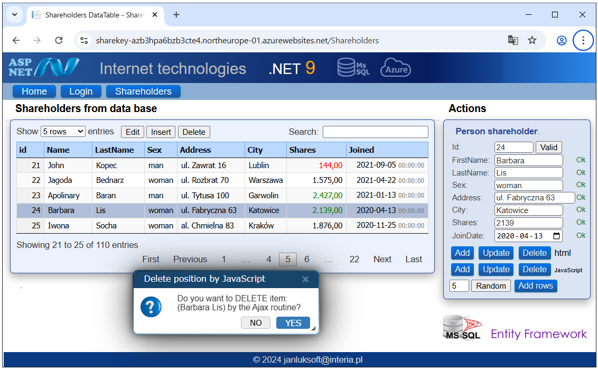

#  Azure Services  

The published application on Azure in the PaaS model has the entire Run Time CLR on the server needed to run the application and perform the necessary procedures. Below is a view of my application running on Azure. It is placed on the North Europe server, and the Poland Central database.

The application uses two Azure services: Key Vault and Blob Storage on the North Europe server.

This does not prevent the application from working efficiently.

